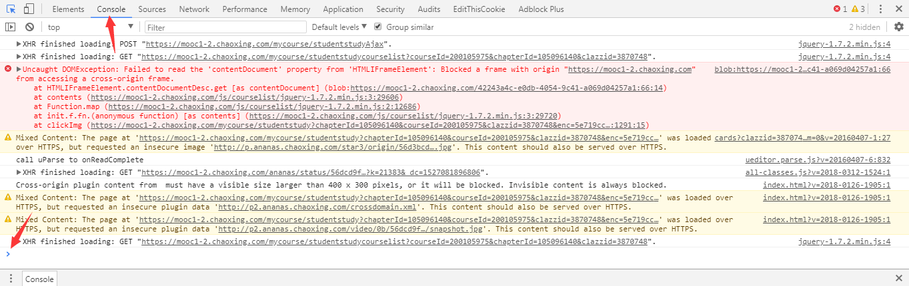

# 使用教程

- 下载Chrome浏览器（不推荐使用其他浏览器）
  - [官网（有时无法连接）](https://google.cn/chrome/)
  - [百度（推荐普通下载）](http://rj.baidu.com/soft/detail/14744.html?ald)
- 使用 **Chrome浏览器** 打开网课 **播放页**
- 按下 **Ctrl+Shift+I** 打开开发者工具，点击`Console选项卡`或者按下`ESC`调整到如下图所示状态。
  - 
- 复制 **脚本代码**
  - 
- 在最后一行 `>` 处粘贴代码
  - 
- 按下回车
- 出现 `初始化数据` 字样即成功（上图为`智慧树刷课`程序提示，出现蓝色的`初始化数据`为`超星网课`程序）
